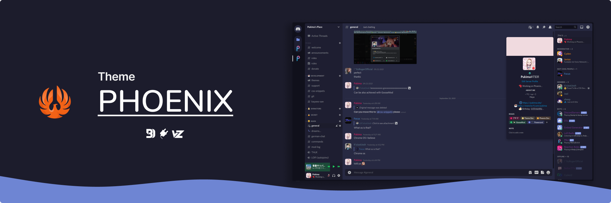

#  Phoenix</img>

<kbd></kbd>
<kbd></kbd>

## ⭐ Features
- [Discolored](https://github.com/NYRI4/Discolored) und [RevertRebrand](https://github.com/Goose-Nest/GT-RevertRebrand) eingebaut
- Anpassung via Variablen (Avatarradius etc.)
- schöne lila farben
- Keine Feature Einsparrungen (Ich hasse es immer wenn Themes manche Features von Discord entfernen)

## 📥 Installation
### 🔌 Powercord
`git clone https://github.com/Pukimaa/phoenix-discord` in deinem Themes-Ordner

### ⚪ Vitality
`git clone https://github.com/Pukimaa/phoenix-discord` in deinem Themes-Ordner

### 🦆 GooseMod
Nutze den eingebauten Store

### 🔵 BetterDiscord
1. Lade diese Datei runter: https://phoenixcolors.github.io/phoenix-discord/phoenix.theme.css
2. Platziere die Datei in:
    - Windows: `%AppData%\betterdiscord\themes`
    - Linux: `~/.config/BetterDiscord/themes`
    - Mac: `~/Library/Application Support/betterdiscord/themes`
3. In Discord gehe zu `Usersettings > Themes` und aktiviere *Phoenix*

## ️️️❤️ Credits
* Ich habe mich sehr von [Couve](https://github.com/NYRI4/Couve) und [Comfy](https://github.com/NYRI4/Comfy/) von Nyria inspirieren lassen. Teile etwas Liebe mit ihm!
* Mein Hintergrund (in der Vorschau): [von Casey Horner auf Unsplash](https://unsplash.com/photos/RmoWqDCqN2E?utm_source=unsplash&utm_medium=referral&utm_content=creditShareLink)
