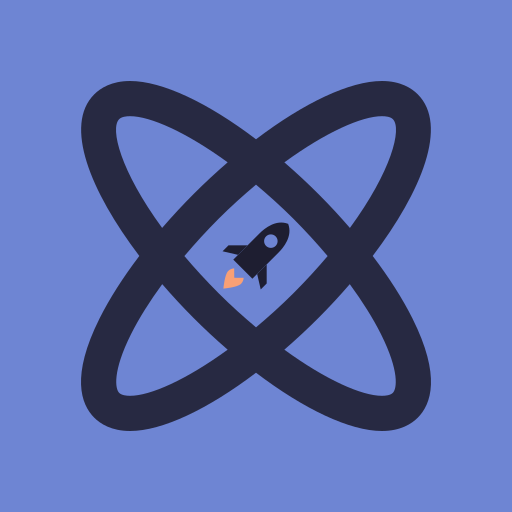
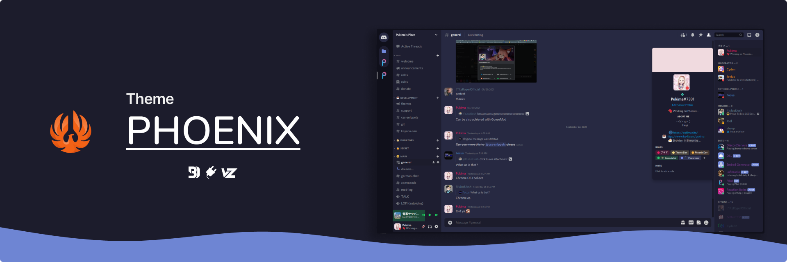

#  Phoenix</img>

<kbd></kbd>
<kbd></kbd>

## ⚠️ Bilješka
Ova tema je u beta procesu i možda ćete naići na bugove i možda tema neće ostati ista u drugim dijelovima. Ako želite javiti neuređeni dio teme ili bilo koje druge bugove molim vas da otvorite "issue" (ili napravite PR sto je puno lakše za mene)!

## ⭐ Značajke
- [Discolored](https://github.com/NYRI4/Discolored) and [RevertRebrand](https://github.com/Goose-Nest/GT-RevertRebrand) već ugrađeno
- Uređivanje sa varijablama (AvatarRadius itd.)
- Ljepe ljubičaste boje
- Nema uklonjenih značajka (Uvijek mrzim kada teme uklone neke discord značajke)

## 📥 Instalacija

### 🔌 Powercord
`git clone https://github.com/Pukimaa/phoenix-discord` u vašem folderu s temama

### ⚪ Vizality
`git clone https://github.com/Pukimaa/phoenix-discord` u vašem folderu s temama

### 🦆 GooseMod
Koristite ugradeni "dućan".

### 🔵 BetterDiscord
1. Skinite ovaj file: https://phoenixcolors.github.io/phoenix-discord/phoenix.theme.css
2. Stavite ga u:
    - Windows: `%AppData%\betterdiscord\themes`
    - Linux: `~/.config/BetterDiscord/themes`
    - Mac: `~/Library/Application Support/betterdiscord/themes`
3. U Discord otiđite u `Korisnicke Postavke > Themes/Theme` i aktivirajte *Phoenix*

## ️️️❤️ Zasluge
* Uzimao sam puno inspiracije od [Couve](https://github.com/NYRI4/Couve) i [Comfy](https://github.com/NYRI4/Comfy/) od Nyria. Hvala ti puno!
* Moja pozadina (na pretpregledu): [od Casey Hornera na Unsplashu](https://unsplash.com/photos/RmoWqDCqN2E?utm_source=unsplash&utm_medium=referral&utm_content=creditShareLink)
