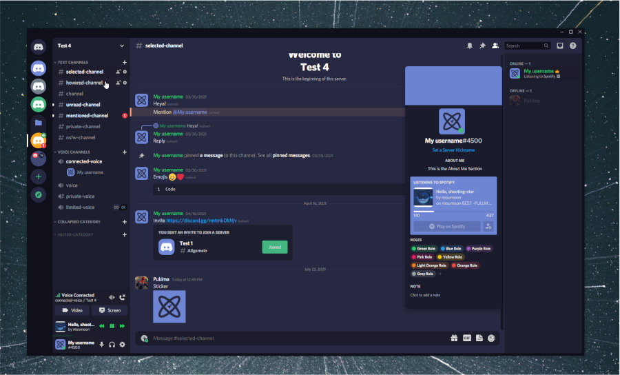

#  Phoenix

---

## ⚠️ NOTE
This Theme is in Beta and there might be bugs and maybe the Theme will not stay how it looks in some parts. If you wanna report Unthemed Parts or any other Bugs please open a Issue (or make a PR which is much easier for me)!

## ⭐ Features
- [Discolored](https://github.com/NYRI4/Discolored) and [RevertRebrand](https://github.com/Goose-Nest/GT-RevertRebrand) built in
- Customization via variables (Avatarradius etc.)
- pretty purplish colors
- No feature lacks (I always hate it when Themes remove some Discord Features)

## 📥 Installation
### 🔌 Powercord
`git clone https://github.com/Pukimaa/phoenix-discord` in your Themes Folder

### ⚪ Vitality
Should be the same as Powercord

### 🦆 GooseMod
Use the built in Store

## ️️️❤️ Credits
* I was taking a lot of Inspiration of [Couve](https://github.com/NYRI4/Couve) and [Comfy](https://github.com/NYRI4/Comfy/) by Nyria. Share some love with him!
* My Background (on the Preview): [from Casey Horner on Unsplash](https://unsplash.com/photos/RmoWqDCqN2E?utm_source=unsplash&utm_medium=referral&utm_content=creditShareLink)
